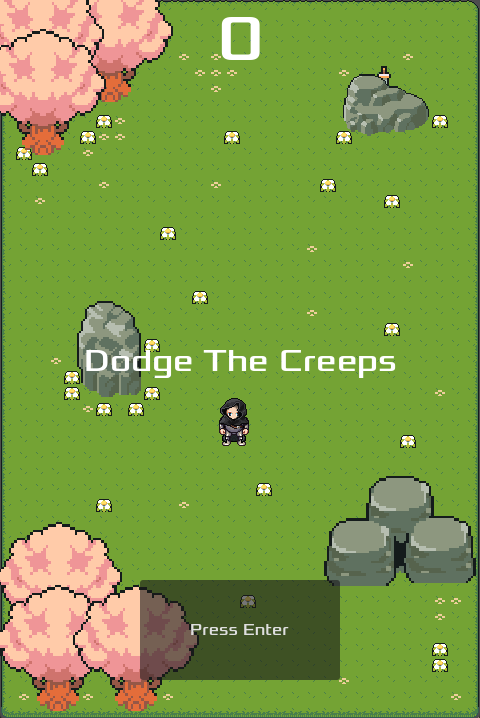

# 🎮 Dodge The Creeps


> A top-down survival game where your only goal is to stay alive — for as long as you possibly can.

---

## 📖 Project Overview

**Dodge The Creeps** is a fast-paced 2D survival game built with the Godot Engine. You control a lone adventurer navigating a lush pixel-art world overrun by relentless monsters — bats and slimes that swarm from every direction. The longer you survive, the higher your score climbs.

There are no weapons, no power-ups, just you, your reflexes, and the ever-increasing chaos around you. Every run is a race against the clock and the creeps.

---

## ✨ Features

- **Endless Survival Gameplay** — Mobs spawn continuously and increase in density over time, keeping the pressure constant.
- **Dynamic Mob System** — Enemies (bats and slimes) spawn at random positions along the screen border and move toward the play area at varied speeds.
- **Randomized Mob Types** — Each enemy randomly picks from available animated types, keeping encounters visually varied.
- **Animated Player Character** — Directional sprite animations for moving up, down, and sideways, creating a responsive feel.
- **Score System** — A live score counter ticks up every second you stay alive.
- **Pixel-Art Aesthetic** — Handcrafted tile maps, animated environmental decorations, and sprite-based characters built from the Liberated Pixel Cup asset library.
- **Ambient World Detail** — Static bodies like trees, rocks, and boulders populate the map for visual depth.
- **Background Music & Sound Effects** — Atmospheric BGM plays during gameplay, with a distinct game-over sound on death.
- **Clean HUD** — Minimal heads-up display showing your live score, messages, and a start prompt.
- **Keyboard Controls** — Full WASD and arrow key support for fluid 8-directional movement.

---

## 📸 Screenshots

### Gameplay

> *Screenshot placeholder — replace with an actual in-game screenshot.*



---

## 🚀 Installation Guide

### Prerequisites

- [Godot Engine 4.6](https://godotengine.org/download) installed on your machine.

### Steps

1. **Clone the repository**

   ```bash
   git clone https://github.com/your-username/pascua-dodge-the-creeps.git
   ```

2. **Navigate into the project folder**

   ```bash
   cd pascua-dodge-the-creeps
   ```

3. **Open the project in Godot**

   - Launch **Godot Engine**.
   - Click **Import** and browse to the cloned folder.
   - Select the `project.godot` file and click **Import & Edit**.

4. **Run the game**

   - Press **F5** (or click the ▶ Play button) in the Godot editor to start the game.

---

## 🎮 Controls

| Action     | Keyboard Keys              |
|------------|----------------------------|
| Move Up    | `W` / `↑` Arrow Key        |
| Move Down  | `S` / `↓` Arrow Key        |
| Move Left  | `A` / `←` Arrow Key        |
| Move Right | `D` / `→` Arrow Key        |
| Start Game | `Enter` / `Space` / `LMB`  |

---

## 🛠️ Technologies Used

| Tool / Technology    | Purpose                              |
|----------------------|--------------------------------------|
| **Godot Engine 4.6** | Game engine and scene management     |
| **GDScript**         | Game logic and scripting             |
| **TileMapLayer**     | World tilemap and terrain rendering  |
| **AnimatedSprite2D** | Character and mob animations         |
| **RigidBody2D**      | Mob physics and movement             |
| **CharacterBody2D**  | Player movement and collision        |
| **CanvasLayer / HUD**| UI overlay (score, messages, button) |
| **AudioStreamPlayer**| Background music and sound effects   |

---

## 🙏 Credits

### Developer
- **Pascua**

### Art Assets
| Asset | Creator |
|-------|---------|
| Character Spritesheet | [The Liberated Pixel Cup](https://lpc.opengameart.org/) |
| Environment / Nature Tiles | [FlowFrog101](https://flowfrog101.itch.io/) |
| Bat Sprite | [Phantom Cooper](https://phantomcooper.itch.io/) |
| Slime Sprite | [pixel-boy](https://pixel-boy.itch.io/) |
| Additional Sprites / Tiles | [pixel-boy](https://pixel-boy.itch.io/) |

### Music & Sound
| Audio | Source |
|-------|--------|
| Background Music | [pixel-boy](https://pixel-boy.itch.io/) |
| Game Over SFX | [pixel-boy](https://pixel-boy.itch.io/) |

---

*Built with ❤️ using Godot Engine.*
